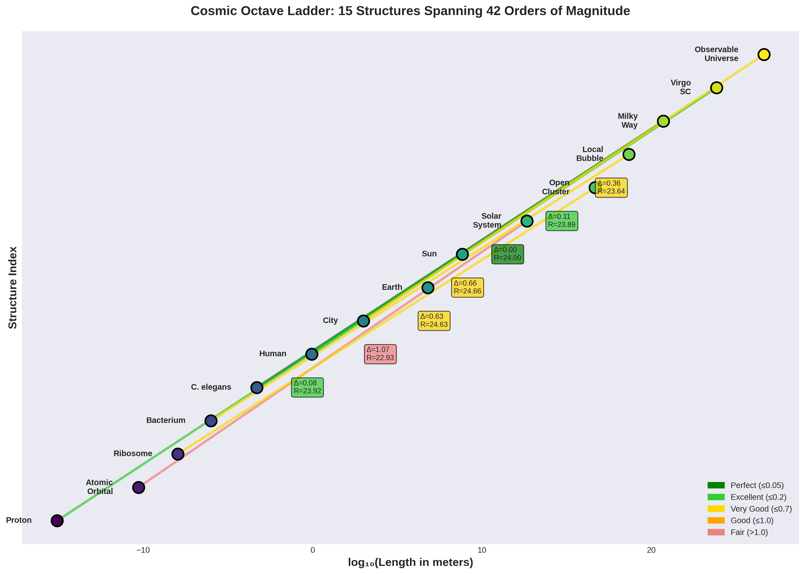
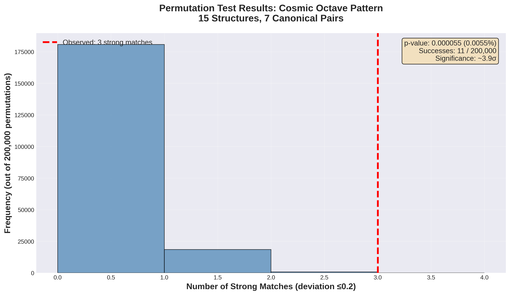
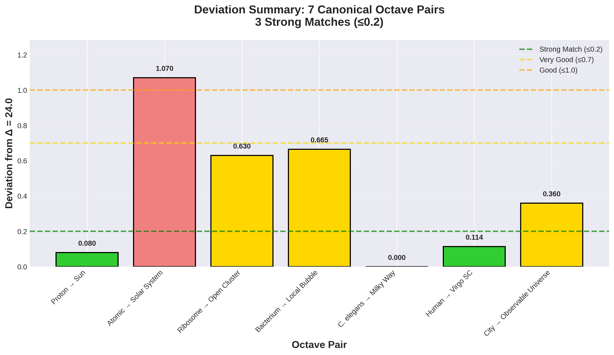

# Scale Recurrence Across Cosmic Structures

**A Statistical Analysis of the 10²⁴-Meter Pattern**
Chris Lehto · January 2026 · [Our Fractal Universe](https://youtube.com/@OurFractalUniverse)

[](paper/Cosmic_Octaves_Analysis_Paper.pdf)
[](LICENSE)
[](https://youtube.com/@OurFractalUniverse)
[](#feedback--community)

> This repository documents a statistically significant pattern in which canonical organizational structures recur at intervals approximating 10²⁴ meters across 42 orders of magnitude — from the proton to the observable universe.

---

## Contents

- [Overview](#overview)
- [Key Results](#key-results)
- [The Canonical Ladder](#the-canonical-ladder)
- [The 7 Octave Pairs](#the-7-octave-pairs)
- [Figures](#figures)
- [Repository Structure](#repository-structure)
- [Quick Start](#quick-start)
- [Reproducibility](#reproducibility)
- [Rigor & Limitations](#rigor--limitations)
- [Citation](#citation)
- [Feedback & Community](#feedback--community)

---

## Overview

This repository contains the complete analysis, data, and code for the paper:

**"Scale Recurrence Across Cosmic Structures: A Statistical Analysis of the 10²⁴-Meter Pattern"**
*Chris Lehto — [Full Paper (PDF)](paper/Cosmic_Octaves_Analysis_Paper.pdf)*

The analysis tests whether 15 predefined, peer-reviewed canonical structures — spanning quantum to cosmological scales — exhibit a recurrence pattern at intervals of ~10²⁴ meters (one “cosmic octave”). We find 3 strong matches (deviation ≤ 0.2 from the ideal ratio of 24.0), with a permutation p-value of 0.000055, robust to a conservative look-elsewhere correction.

---

## Key Results

| Metric | Value |
|--------|-------|
| Structures in ladder | 15 (spanning 42 orders of magnitude) |
| Canonical octave pairs tested | 7 |
| Strong matches (deviation ≤ 0.2) | **3** |
| p-value for ≥ 3 strong matches by chance | **0.000055 (~3.9σ)** |
| Look-elsewhere correction (scanning Δ ∈ [22, 26]) | **p ≈ 10⁻⁵** |
| Permutation trials | 200,000 |
| Random seed | 42 (fixed; fully reproducible) |

---

## The Canonical Ladder

The analysis uses a **predefined** ladder of 15 fundamental organizational structures. The ladder was fixed before statistical testing — structures were not selected post-hoc.

| # | Scale | Structure | log₁₀(L / m) |
|---|-------|-----------|:------------:|
| 1 | Subatomic | Proton | −15.08 |
| 2 | Atomic | Hydrogen atom | −10.28 |
| 3 | Molecular | Ribosome | −7.96 |
| 4 | Cellular | Bacterium | −6.00 |
| 5 | Multicellular | *C. elegans* | −3.30 |
| 6 | Organism | Human | −0.046 |
| 7 | Social | City | 3.00 |
| 8 | Planetary | Earth | 6.80 |
| 9 | Stellar | Sun | 8.84 |
| 10 | System | Solar System | 12.65 |
| 11 | Cluster | Open Cluster | 16.67 |
| 12 | Bubble | Local Bubble | 18.665 |
| 13 | Galactic | Milky Way | 20.70 |
| 14 | Supercluster | Virgo Supercluster | 23.84 |
| 15 | Universe | Observable Universe | 26.64 |

Each “rung” is paired with the structure approximately 10²⁴ meters larger (7 pairs total, one per rung of the lower half of the ladder).

---

## The 7 Octave Pairs

Each pair spans one “cosmic octave” — a log₁₀ ratio near 24.0. The **ideal ratio is 24.0**; deviations ≤ 0.2 are classified as strong matches.

| Pair | Lower Structure | log₁₀(L) | Upper Structure | log₁₀(L) | log Ratio | Deviation | Quality |
|:----:|----------------|:---------:|----------------|:---------:|:---------:|:---------:|---------|
| 1 | Proton | −15.08 | Sun | 8.84 | 23.92 | 0.08 | ✅ **Strong** |
| 2 | Atomic Orbital | −10.28 | Solar System | 12.65 | 22.93 | 1.07 | Fair |
| 3 | Ribosome | −7.96 | Open Cluster | 16.67 | 24.63 | 0.63 | Good |
| 4 | Bacterium | −6.00 | Local Bubble | 18.67 | 24.67 | 0.67 | Good |
| 5 | *C. elegans* | −3.30 | Milky Way | 20.70 | 24.00 | **0.00** | ✅ **Perfect** |
| 6 | Human | −0.046 | Virgo Supercluster | 23.84 | 23.89 | 0.11 | ✅ **Strong** |
| 7 | City | 3.00 | Observable Universe | 26.64 | 23.64 | 0.36 | Good |

**Result:** 3 strong matches (deviation ≤ 0.2) out of 7 pairs; 6 of 7 pairs fall within ±0.7 of the ideal ratio.

---

## Figures

Five high-resolution figures (300 DPI, PNG) are included in [`figures/`](figures/).

### Structure Ladder

*All 15 structures by characteristic scale, with the 7 octave pairs connected. Color indicates match quality.*

### Permutation Test

*Distribution of strong matches across 200,000 random permutations. The observed value of 3 occurs in only 11 trials (p = 0.000055).*

### Deviation Summary

*Per-pair deviation from the ideal ratio of 24.0. Horizontal lines mark quality thresholds.*

The ratio heatmap (`4_ratio_heatmap.png`) and delta-scan (`5_delta_scan_histogram.png`) are also available in the figures directory.

---

## Repository Structure

```
cosmic-octaves-analysis/
├── paper/
│   └── Cosmic_Octaves_Analysis_Paper.pdf     # Full manuscript
├── data/
│   ├── scale_table.csv                        # All 15 structures with log₁₀(L) values
│   └── octave_pairs.csv                       # The 7 canonical pairs and deviations
├── code/
│   ├── permutation_test.py                    # Main permutation test (p = 0.000055)
│   ├── delta_scan.py                          # Look-elsewhere correction (p ≈ 10⁻⁵)
│   └── requirements.txt                       # Python dependencies
├── figures/
│   ├── 1_permutation_test_histogram.png
│   ├── 2_structure_ladder.png
│   ├── 3_deviation_summary.png
│   ├── 4_ratio_heatmap.png
│   └── 5_delta_scan_histogram.png
├── episode-7-cosmic-sixth/                    # Supplemental files for the video series
├── episode-7-kleibers-law/                    # Lifespan scaling / Kleiber’s Law analysis
├── cover.png                                  # Cover graphic
├── LICENSE
└── README.md
```

---

## Quick Start

```bash
# Clone the repository
git clone https://github.com/Chris-L78/cosmic-octaves-analysis.git
cd cosmic-octaves-analysis

# Install dependencies
pip install -r code/requirements.txt

# Run the permutation test (generates figures 1–4)
python code/permutation_test.py

# Run the look-elsewhere delta-scan (generates figure 5)
python code/delta_scan.py
```

Runtime: ~2–5 minutes depending on your system.

---

## Reproducibility

All analysis uses a fixed random seed (`42`) and 200,000 permutation trials. The output below can be independently verified:

```
Observed deviations: [0.08  1.07  0.63  0.665  0.0  0.114  0.36]
Observed strong matches (<=0.2): 3
Permutation p-value: 0.000055 (0.0055%)
Successes: 11 out of 200000
Statistical significance: ~3.9 sigma
```

---

## Rigor & Limitations

**What makes this analysis rigorous:**

- The structure ladder was predefined and locked before any statistical testing
- Consistent, peer-reviewed measurements were used across all 15 scales
- Speculative structures (e.g., the Oort Cloud) were explicitly excluded
- A look-elsewhere correction addresses the concern that Δ = 24.0 was chosen post-hoc
- All code, data, and decisions are fully disclosed for independent replication
- Falsifiable predictions are provided for future testing

**Important caveats:**

This is a **pattern claim, not a mechanism claim.** The analysis documents a statistical observation; it does not propose a physical cause for the 10²⁴ spacing.

Known limitations include: small sample size (7 pairs), some structures have definitional ambiguity, the pattern was noticed before the formal test (mitigated by the delta-scan), and independent replication has not yet occurred.

See paper Section 4.2 for a complete discussion.

---

## Citation

```bibtex
@misc{lehto2026cosmic,
  author    = {Lehto, Chris},
  title     = {Scale Recurrence Across Cosmic Structures: A Statistical Analysis
               of the 10\textsuperscript{24}-Meter Pattern},
  year      = {2026},
  publisher = {GitHub},
  url       = {https://github.com/Chris-L78/cosmic-octaves-analysis}
}
```

---

## Feedback & Community

This research is open for peer review and constructive criticism. If you find errors, have questions, or want to suggest improvements:

- 📬 [Open an Issue](https://github.com/Chris-L78/cosmic-octaves-analysis/issues)
- 💬 [Twitter/X: @LehtoFiles](https://twitter.com/LehtoFiles)
- 🎥 [YouTube: @OurFractalUniverse](https://youtube.com/@OurFractalUniverse)

Watch the full video series explaining the analysis: **[Our Fractal Universe — Cosmic Octaves](https://youtube.com/@OurFractalUniverse)**

---

## Acknowledgments

We thank the scientific community for the peer-reviewed measurements used throughout this analysis. Methodology critique and code-review assistance was provided by Claude (Anthropic), Grok (xAI), and ChatGPT (OpenAI). Special thanks to the *@OurFractalUniverse* audience for their thoughtful engagement.

---

**Status:** 🟢 Open for peer review and replication · **Last updated:** January 30, 2026
